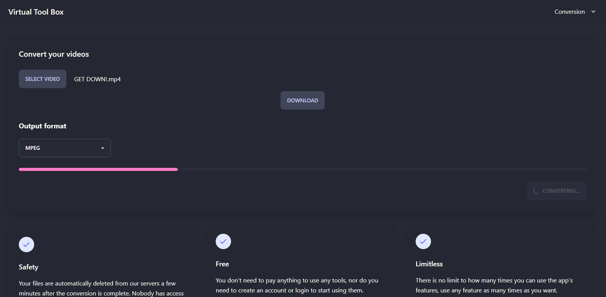

<h1 align="center">Tool Box Virtual - Frontend</h1>

<p>Application that converts video to some formats using ffmpeg</p>

<h1 align="center">
  
</h1>

### 🛠 Main technologies

The following tools were used in building the project:

- [Nodejs](https://nodejs.org/en/)
- [Next.js](https://nextjs.org/)
- [NestJs](https://nestjs.com/)
- [Tailwind CSS](https://tailwindcss.com/)
- [daisyUI](https://daisyui.com/)
- [TypeScript](https://www.typescriptlang.org/)

### 💻 Functionalities

- ✅ Video conversion

### ⚠️ Prerequisites

- [Install Nodejs](https://nodejs.org/en/)
- [Install Next.js](https://nextjs.org/)

## Installation

```bash
$ npm install
```

## Running the app

```bash
npm run dev
# or
yarn dev
```

### 📄 License

- [MIT](https://github.com/sal-rosa/frontend-tool-box-virtual/blob/main/License)
